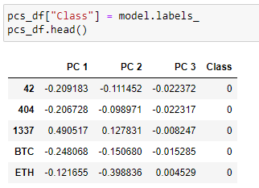
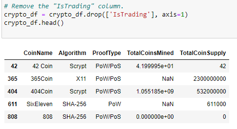
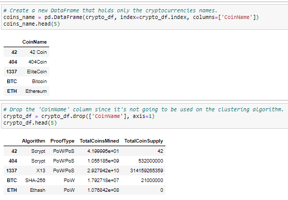
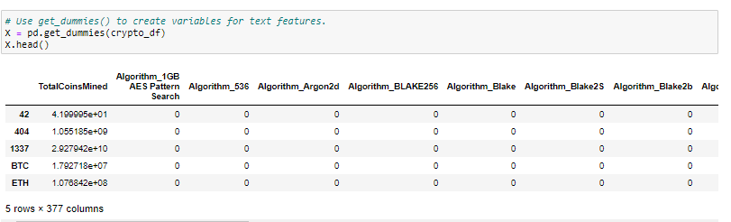
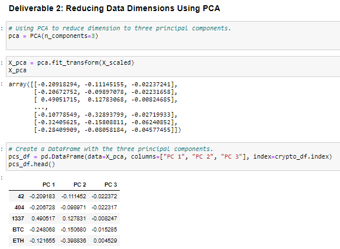
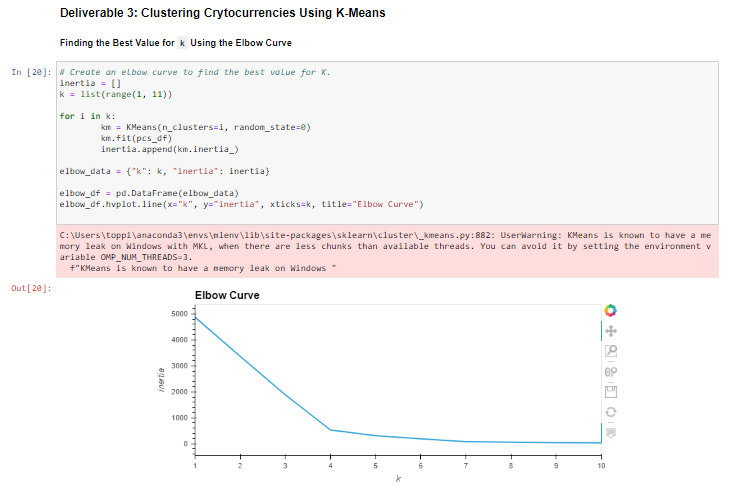
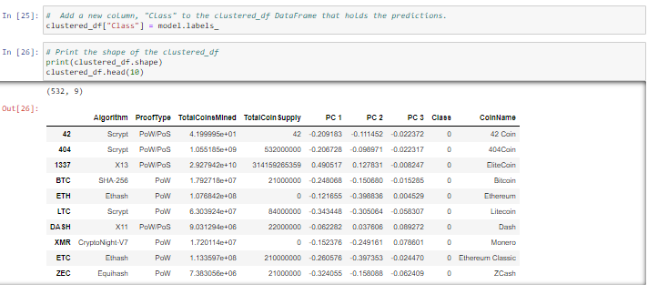
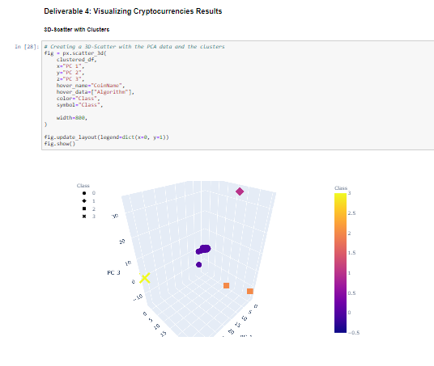
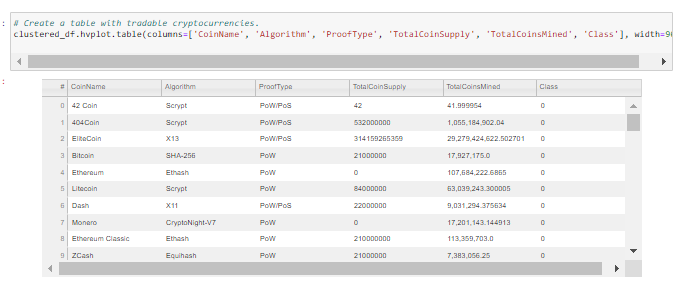
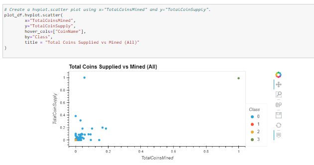

# Cryptocurrencies overview of analysis
    we created a report that includes what cryptocurrencies are on the trading market and how they could be grouped to create a classification system for this new investment using unsupervised learning. 
    -how to process data
    -how to cluster
    -how to reduce dimensions
    -how to reduce the principal components using PCA
# Resources
    jupyter notebooks
    PCA
    KMeans
    Unsupervised machine learning
## Summary

